# LLM Context System Flow Diagrams

## Context Restoration Flow (Session Start)

```mermaid
flowchart TD
    A["👤 HUMAN: Starts Session"] --> B{"👤 HUMAN: Copy-Paste Session Command?"}
    B -->|Yes| C["🤖 LLM: Reads Session Command"]
    B -->|No| D["🤖 LLM: Generic Start"]
    
    C --> E["🤖 LLM: Read session-handoff.md"]
    E --> F["🤖 LLM: Read current-iteration.md"]
    F --> G["🤖 LLM: Read static/environment.md"]
    G --> H["🤖 LLM: Check dynamic/failed-solutions/"]
    H --> I["🤖 LLM: Read evolving/assumptions-log.md"]
    
    I --> J["🤖 LLM: Analyze Context Files"]
    J --> K["🤖 LLM: Generate 3-5 Specific Questions"]
    K --> L["🤖 LLM: Ask Context-Based Questions"]
    L --> M["👤 HUMAN: Responds to Questions"]
    M --> N["🤖 LLM: Understands Current State"]
    N --> O["🤖 LLM: Begin Productive Session"]
    
    D --> P["🤖 LLM: Ask Generic Questions"]
    P --> Q["👤 HUMAN: Provides Context Manually"]
    Q --> R["🤖 LLM: Less Efficient Session Start"]
    
    style A fill:#e1f5fe
    style C fill:#c8e6c9
    style E fill:#fff3e0
    style F fill:#fff3e0
    style G fill:#fff3e0
    style H fill:#ffebee
    style I fill:#f3e5f5
    style O fill:#e8f5e8
    style R fill:#ffcdd2
```



## Context Saving Flow (Session End)

```mermaid
flowchart TD
    A["🤖 LLM: Session Work Completed"] --> B{"👤 HUMAN: Triggers End?"}
    B -->|Copy-Paste End Command| C["🤖 LLM: Reads End Command"]
    B -->|Manual End| D["🤖 LLM: Recognizes Session End"]
    B -->|No Explicit End| E["❌ SYSTEM: Context Not Saved - Risk!"]
    
    C --> F["🤖 LLM: Assess Session Accomplishments"]
    D --> F
    F --> G["🤖 LLM: Update working-solutions.md"]
    G --> H["🤖 LLM: Update failed-solutions/"]
    H --> I["🤖 LLM: Update assumptions-log.md"]
    I --> J["🤖 LLM: Update current-iteration.md"]
    J --> K["🤖 LLM: Update session-handoff.md"]
    K --> L["🤖 LLM: Update static/knowledge-base/"]
    L --> M["🤖 LLM: Create daily log in archive/"]
    
    M --> N["🤖 LLM: Generate Closure Questions"]
    N --> O["🤖 LLM: Ask About Next Session Priorities"]
    O --> P["👤 HUMAN: Responds to Questions"]
    P --> Q["🤖 LLM: Update Context with Next Session Info"]
    Q --> R["✅ SYSTEM: Session Properly Closed"]
    
    E --> S["❌ SYSTEM: Context Loss Risk"]
    S --> T["❌ SYSTEM: Next Session Starts Cold"]
    
    style A fill:#e1f5fe
    style C fill:#c8e6c9
    style D fill:#fff9c4
    style E fill:#ffcdd2
    style F fill:#fff3e0
    style G fill:#e8f5e8
    style H fill:#ffebee
    style I fill:#f3e5f5
    style J fill:#fff3e0
    style K fill:#fff3e0
    style L fill:#e8f5e8
    style M fill:#f3e5f5
    style R fill:#e8f5e8
    style S fill:#ffcdd2
    style T fill:#ffcdd2
```



## Detailed Context Restoration Process

### Trigger: Human Copy-Pastes Session Start Command
```
Start session: Read context (session-handoff, current-iteration, environment, failed-solutions), ask 3-5 specific questions based on what you find, then summarize status and next actions.
```

### File Reading Priority Order:
1. **session-handoff.md** (CRITICAL) - Immediate context, where you left off
2. **current-iteration.md** (IMPORTANT) - Active goals and hypothesis
3. **environment.md** (ESSENTIAL) - Hardware/software constraints
4. **failed-solutions/** (MANDATORY) - Avoid suggesting failed approaches
5. **assumptions-log.md** (REFERENCE) - Validation history and evidence

### Context Analysis Process:

```mermaid
flowchart LR
    A["🤖 LLM: Read Files"] --> B["🤖 LLM: Identify Current Status"]
    B --> C["🤖 LLM: Find Blockers/Risks"]
    C --> D["🤖 LLM: Determine Priorities"]
    D --> E["🤖 LLM: Generate Specific Questions"]
    E --> F["🤖 LLM: Ask Human for Clarification"]
```


## Detailed Context Saving Process

### Trigger: Human Copy-Pastes Session End Command
```
End session: Compile knowledge (update working-solutions.md, failed-solutions/, create daily log in archive/daily-logs/), update session-handoff.md and current-iteration.md, update knowledge base in static/knowledge-base/, ask closure questions about knowledge completeness and next priorities.
```

### Knowledge Compilation Process:

```mermaid
flowchart TD
    A["🤖 LLM: Assess Session Accomplishments"] --> B{"🤖 LLM: Working Solutions Found?"}
    B -->|Yes| C["🤖 LLM: Update working-solutions.md"]
    B -->|No| D{"🤖 LLM: Failed Attempts Made?"}
    
    C --> D
    D -->|Yes| E["🤖 LLM: Update failed-solutions/"]
    D -->|No| F{"🤖 LLM: Validation Results?"}
    
    E --> F
    F -->|Yes| G["🤖 LLM: Update assumptions-log.md"]
    F -->|No| H{"🤖 LLM: Progress Made?"}
    
    G --> H
    H -->|Yes| I["🤖 LLM: Update current-iteration.md"]
    H -->|No| J["🤖 LLM: Prepare Next Session"]
    
    I --> J["🤖 LLM: Update session-handoff.md"]
    J --> K{"🤖 LLM: Knowledge Base Updates?"}
    K -->|Yes| L["🤖 LLM: Update static/knowledge-base/"]
    K -->|No| M["🤖 LLM: Create Daily Log"]
    
    L --> M["🤖 LLM: Create archive/daily-logs/"]
    M --> N["🤖 LLM: Generate Closure Questions"]
```


## Context Continuity Validation

### Successful Context Restoration Indicators:
- [ ] LLM asks specific questions about current work (not generic)
- [ ] LLM references exact details from context files
- [ ] LLM avoids suggesting previously failed solutions
- [ ] LLM understands current iteration goals and constraints
- [ ] Session starts productively within 30 seconds

### Successful Context Saving Indicators:
- [ ] All discoveries documented in appropriate files
- [ ] Next session priorities clearly defined
- [ ] Working solutions preserved with exact commands
- [ ] Failed solutions documented with error details
- [ ] Knowledge base updated with new insights

## Risk Mitigation

### Context Restoration Risks:
- **Risk:** Human doesn't use session start command
- **Mitigation:** LLM asks generic questions, less efficient start
- **Prevention:** Educate human on copy-paste commands

- **Risk:** Context files are outdated or inconsistent
- **Mitigation:** Run validation script to assess actual state
- **Prevention:** Proper session closure in previous session

### Context Saving Risks:
- **Risk:** Human ends session without proper closure
- **Mitigation:** Context not updated, next session starts cold
- **Prevention:** Educate human on session end command importance

- **Risk:** LLM doesn't update all necessary files
- **Mitigation:** Use comprehensive end command checklist
- **Prevention:** Follow structured knowledge compilation process

## Integration with Project Types

### Technical Projects (like GStreamer):
- **Restoration Focus:** Current implementation status, build environment, test results
- **Saving Focus:** Working commands, failed approaches, performance metrics

### Research Projects:
- **Restoration Focus:** Current hypothesis, experimental design, data collection status
- **Saving Focus:** Research findings, methodology insights, next research questions

### Documentation Projects:
- **Restoration Focus:** Content structure, writing progress, review status
- **Saving Focus:** Content insights, style decisions, organization improvements

### Collaborative Projects:
- **Restoration Focus:** Team status, decision points, communication needs
- **Saving Focus:** Team insights, coordination improvements, decision rationale

## Process Analysis & Improvements

### 🚨 Identified Problems in Current Flow

#### Context Restoration Issues:
1. **Missing File Validation**
   - **Problem:** LLM attempts to read files without checking if they exist
   - **Risk:** Process fails silently or with confusing errors
   - **Impact:** Session starts with incomplete context

2. **No Context Freshness Check**
   - **Problem:** No validation that context files are current/relevant
   - **Risk:** LLM works with stale information
   - **Impact:** Decisions based on outdated assumptions

3. **Human Response Quality**
   - **Problem:** Human might not understand LLM's context-based questions
   - **Risk:** Provides incomplete or incorrect clarification
   - **Impact:** Session starts with wrong understanding

4. **No Context Validation**
   - **Problem:** No verification that LLM correctly understood context
   - **Risk:** LLM proceeds with misunderstood context
   - **Impact:** Entire session based on wrong assumptions

#### Context Saving Issues:
1. **No Update Verification**
   - **Problem:** No confirmation that file updates were successful
   - **Risk:** Context appears saved but actually failed
   - **Impact:** Next session loses critical information

2. **Incomplete Knowledge Capture**
   - **Problem:** LLM might miss important discoveries or insights
   - **Risk:** Knowledge is lost between sessions
   - **Impact:** Repeated work and lost progress

3. **Human Closure Quality**
   - **Problem:** Human might not provide complete information in closure questions
   - **Risk:** Next session context is incomplete
   - **Impact:** Poor session handoff

4. **No Backup Mechanism**
   - **Problem:** File updates might corrupt existing context
   - **Risk:** Loss of all previous context
   - **Impact:** Complete system failure

#### System-Level Issues:
1. **Heavy Human Dependency**
   - **Problem:** Relies entirely on human remembering copy-paste commands
   - **Risk:** Humans forget or use wrong commands
   - **Impact:** System doesn't work as intended

2. **No Automated Detection**
   - **Problem:** No automatic detection of session start/end
   - **Risk:** Sessions run without proper context management
   - **Impact:** Context system becomes optional/ignored

3. **No Recovery Mechanisms**
   - **Problem:** No fallback when things go wrong
   - **Risk:** System failure leads to complete context loss
   - **Impact:** Users abandon the system

### 🔧 Proposed Improvements

#### Enhanced Context Restoration Flow:

```mermaid
flowchart TD
    A["👤 HUMAN: Starts Session"] --> B{"👤 HUMAN: Copy-Paste Session Command?"}
    B -->|Yes| C["🤖 LLM: Reads Session Command"]
    B -->|No| D["🤖 LLM: Generic Start"]
    
    C --> E["🤖 LLM: Validate Context Files Exist"]
    E -->|Files Missing| F["🤖 LLM: Request Context Restoration"]
    E -->|Files Present| G["🤖 LLM: Check Context Freshness"]
    
    G -->|Stale Context| H["🤖 LLM: Warn About Stale Context"]
    G -->|Fresh Context| I["🤖 LLM: Read Files in Priority Order"]
    
    F --> J["👤 HUMAN: Provides Missing Context"]
    H --> K["👤 HUMAN: Confirms or Updates Context"]
    I --> L["🤖 LLM: Validate Context Consistency"]
    
    J --> L
    K --> L
    L -->|Inconsistent| M["🤖 LLM: Request Clarification"]
    L -->|Consistent| N["🤖 LLM: Generate Context-Based Questions"]
    
    M --> O["👤 HUMAN: Clarifies Inconsistencies"]
    O --> N
    N --> P["🤖 LLM: Validate Understanding"]
    P --> Q["👤 HUMAN: Confirms Understanding"]
    Q --> R["🤖 LLM: Begin Productive Session"]
    
    style E fill:#fff3e0
    style G fill:#fff3e0
    style L fill:#fff3e0
    style P fill:#fff3e0
    style R fill:#e8f5e8
```


#### Enhanced Context Saving Flow:

```mermaid
flowchart TD
    A["🤖 LLM: Session Work Completed"] --> B["🤖 LLM: Pre-Save Validation"]
    B --> C["🤖 LLM: Create Context Backup"]
    C --> D["🤖 LLM: Update Files with Verification"]
    
    D -->|Update Failed| E["🤖 LLM: Restore from Backup"]
    D -->|Update Success| F["🤖 LLM: Validate Updated Content"]
    
    E --> G["🤖 LLM: Report Save Failure"]
    F -->|Validation Failed| H["🤖 LLM: Restore and Retry"]
    F -->|Validation Success| I["🤖 LLM: Generate Quality Report"]
    
    G --> J["👤 HUMAN: Manual Context Save"]
    H --> K["🤖 LLM: Request Human Assistance"]
    I --> L["🤖 LLM: Ask Quality Confirmation"]
    
    J --> M["✅ SYSTEM: Manual Save Complete"]
    K --> N["👤 HUMAN: Assists with Save"]
    L --> O["👤 HUMAN: Confirms Quality"]
    
    N --> I
    O -->|Quality Issues| P["🤖 LLM: Address Quality Issues"]
    O -->|Quality Good| Q["✅ SYSTEM: Session Properly Closed"]
    
    P --> L
    
    style B fill:#fff3e0
    style C fill:#e8f5e8
    style D fill:#fff3e0
    style F fill:#fff3e0
    style I fill:#fff3e0
    style Q fill:#e8f5e8
```


### 🛡️ Robustness Improvements

#### 1. Automated Context Health Checks
```bash
# Add to assumption-validator.py
def validate_context_health():
    """Validate context files are present, consistent, and fresh"""
    - Check file existence and readability
    - Validate file format and structure
    - Check timestamp freshness
    - Verify cross-file consistency
    - Report health score and issues
```

#### 2. Context Backup and Recovery
```bash
# Automatic backup before any updates
def backup_context():
    """Create timestamped backup of all context files"""
    - Create backup directory with timestamp
    - Copy all context files to backup
    - Maintain rolling backup history
    - Provide easy restore mechanism
```

#### 3. Session State Detection
```bash
# Detect session boundaries automatically
def detect_session_state():
    """Automatically detect session start/end patterns"""
    - Monitor for session start indicators
    - Track session activity patterns
    - Detect abrupt session endings
    - Trigger appropriate context management
```

#### 4. Quality Validation Framework
```bash
# Validate context quality before/after updates
def validate_context_quality():
    """Ensure context meets quality standards"""
    - Check completeness of required sections
    - Validate information consistency
    - Verify actionable next steps
    - Score context usefulness
```

### 🔄 Enhanced Workflow Integration

#### Smart Session Start Command:
```
Start session with validation: Check context health, validate files, read context with freshness check, ask specific questions with understanding validation, confirm readiness before proceeding.
```

#### Smart Session End Command:
```
End session with verification: Create backup, compile knowledge with quality checks, update files with verification, validate save success, ask closure questions with completeness check, confirm proper closure.
```

### 📊 Success Metrics for Improvements

#### Context Restoration Success:
- [ ] 100% of context files validated before reading
- [ ] Context freshness checked and reported
- [ ] LLM understanding validated before proceeding
- [ ] Human questions answered with quality confirmation
- [ ] Session starts with verified complete context

#### Context Saving Success:
- [ ] 100% of updates verified successful
- [ ] Backup created before any changes
- [ ] Context quality validated before closure
- [ ] Human closure input completeness verified
- [ ] Next session context prepared and validated

#### System Robustness:
- [ ] Automatic recovery from common failure modes
- [ ] Quality metrics tracked and improved over time
- [ ] Reduced dependency on perfect human behavior
- [ ] Graceful degradation when components fail

### 🎯 Implementation Priority

#### Phase 1 (High Impact, Low Effort):
1. Add file existence validation to context restoration
2. Add update verification to context saving
3. Create simple backup mechanism
4. Add context freshness warnings

#### Phase 2 (Medium Impact, Medium Effort):
1. Implement context consistency validation
2. Add LLM understanding verification
3. Create quality scoring framework
4. Enhance error recovery mechanisms

#### Phase 3 (High Impact, High Effort):
1. Implement automated session detection
2. Create comprehensive quality validation
3. Build advanced recovery mechanisms
4. Develop context optimization algorithms

---

**Purpose:** Visual representation of LLM Context System session flow with problem analysis
**Audience:** Humans and LLMs understanding the system and its improvements
**Usage:** Reference for proper session management, troubleshooting, and system enhancement
